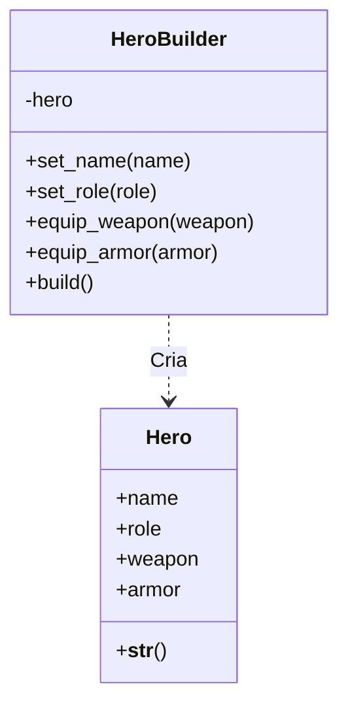

# Padrão de Projeto: Builder

> **Padrão Criacional (Creational)**
>
> O Builder é um padrão de projeto criacional que permite a você construir objetos complexos passo a passo. O padrão permite produzir diferentes tipos e representações de um objeto usando o mesmo código de construção.

---

## Cenário 
Em um jogo de RPG, o personagem (**Hero**) é uma entidade complexa. Ele tem:
* Nome
* Classe (Mago, Guerreiro, Arqueiro)
* Arma (pode ser nenhuma)
* Armadura (pode ser nenhuma)
* Nível, XP, Inventário, Habilidades...

Isso cria a necessidade de uma classe `HeroBuilder`, dedicada exclusivamente para montar o seu herói passo a passo, evitando construtores gigantes e confusos.

---

### Diagrama UML
A estrutura de classes abaixo demonstra como o `HeroBuilder` isola a complexidade da criação do `Hero`:



---

### Explicação do Código
Classe Produto (Hero):

Primeiro, temos a classe que serve apenas como modelo de dados para o herói:

```
class Hero:
    def __init__(self):
        # Inicializa tudo como vazio (None)
        self.name = None
        self.role = None
        self.weapon = None
        self.armor = None

    def __str__(self):
        # Método para imprimir o herói bonitinho no terminal
        return f"Herói [{self.name}] | Classe: {self.role} | Arma: {self.weapon} | Armadura: {self.armor}"
```

Classe Construtora (HeroBuilder):

Utilizamos a classe HeroBuilder. Ela utiliza métodos que retornam o próprio objeto (self) a cada etapa, 
permitindo a configuração das características do herói passo a passo, de forma organizada e legível:

```
class HeroBuilder:
    def __init__(self):
        self.hero = Hero() 

    def set_name(self, name: str):
        self.hero.name = name
        return self

    def set_role(self, role: str):
        self.hero.role = role
        return self

    def build(self) -> Hero:
        result = self.hero
        self.hero = Hero() 
        return result

```

