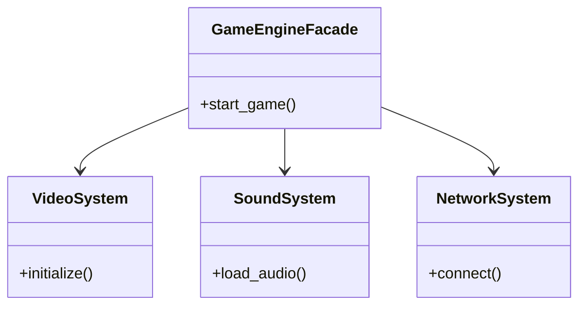

# Padrão de Projeto: Facade

> **Padrão Estrutural (Structural)**
>
> O Facade é um padrão de projeto estrutural que fornece uma interface simplificada para uma biblioteca, um framework ou um conjunto complexo de classes.

---

## Cenário
Ao iniciar nosso jogo, não basta apenas abrir a janela. Uma **Game Engine** moderna precisa realizar uma série de inicializações em uma ordem específica:
1.  Carregar os drivers de vídeo (`VideoSystem`).
2.  Carregar os buffers de áudio (`SoundSystem`).
3.  Conectar aos servidores multiplayer (`NetworkSystem`).

Isso gera complexidade e alto acoplamento se fizermos tudo isso manualmente no código principal. Se a ordem mudar, teremos que reescrever várias partes do código.

---

### Diagrama UML
A estrutura abaixo mostra como a `GameEngineFacade` esconde os subsistemas complexos do restante do código:



---

## Explicação do Código

Subsistemas Complexos:

Estas classes representam as partes complicadas do sistema. No mundo real, elas teriam centenas de linhas de código:

```
class VideoSystem:
    def initialize(self): 

class SoundSystem:
    def load_audio(self):

class NetworkSystem:
    def connect(self):

``` 

Fachada (GameEngineFacade)

Esta classe encapsula a complexidade. No construtor (__init__), ela cria as instâncias necessárias:

```

class GameEngineFacade:
    def __init__(self):
        self.video = VideoSystem()
        self.sound = SoundSystem()
        self.network = NetworkSystem()

    def start_game(self):
        print("\n--- INICIANDO GAME ENGINE ---")
        self.network.connect()
        self.video.initialize()
        self.sound.load_audio()
        print("--- JOGO INICIALIZADO ---\n")

``` 
