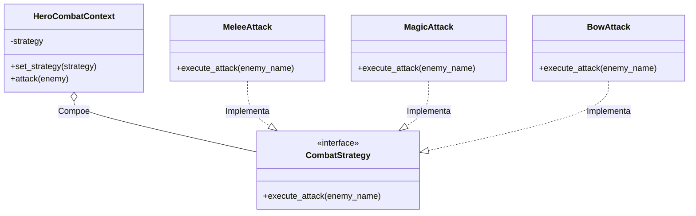

# Padrão de Projeto: Strategy

> **Padrão Comportamental (Behavioral)**
>
> O Strategy é um padrão de projeto comportamental que permite definir uma família de algoritmos, colocar cada um deles em uma classe separada e fazer com que seus objetos sejam intercambiáveis. O Strategy permite que o algoritmo varie independentemente dos clientes que o utilizam.

---

## Cenário 
No jogo temos o combate, onde o nosso herói precisa lutar. Dentro dessa luta temos diversos itens e magias para usar, como Espadas, Bolas de Fogo e Arco e Flecha.

Se tentássemos colocar toda a lógica de ataque dentro da classe `Hero`, teríamos um método gigante e cheio de condicionais (`if weapon == 'sword'...`), o que torna o código difícil de manter e evoluir.

---

### Diagrama UML
A estrutura abaixo mostra como isolamos os algoritmos de ataque em classes separadas:



### Explicação do Código
Interface (CombatStrategy):

Define o contrato que todas as estratégias devem seguir. Em Python, usamos uma Classe Abstrata (ABC):

```
from abc import ABC, abstractmethod

class CombatStrategy(ABC):
    @abstractmethod
    def execute_attack(self, enemy_name: str) -> str:
        pass

```

Estratégias Concretas:

São as implementações reais dos algoritmos de ataque. Cada classe sabe como executar um tipo de golpe:

```
class MeleeAttack(CombatStrategy):
    def execute_attack(self, enemy_name: str) -> str:
        return f"Acertou {enemy_name} com a espada!"

class MagicAttack(CombatStrategy):
    def execute_attack(self, enemy_name: str) -> str:
        return f"Lançou uma bola de fogo em {enemy_name}!"

class BowAttack(CombatStrategy):
    def execute_attack(self, enemy_name: str) -> str:
        return f"Disparou uma flecha em {enemy_name}!"

```

Contexto (HeroCombatContext):

É a classe que interage com o jogo. Ela recebe uma estratégia e pode trocá-la a qualquer momento, sem saber exatamente qual arma está sendo usada:

```
class HeroCombatContext:
    def __init__(self, strategy: CombatStrategy):
        self._strategy = strategy

    def set_strategy(self, strategy: CombatStrategy):
        self._strategy = strategy

    def attack(self, enemy: str):
        print(self._strategy.execute_attack(enemy))

```
